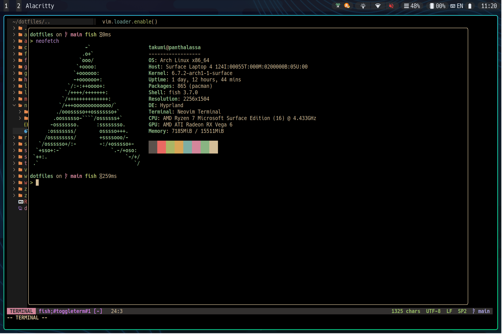

# Dotfiles

A collection of dotfiles.



# Usage

## Download

```
git clone --depth 1 (path_to_this_repo)
```

## Attach & Detach Features

`GNU stow` is useful.

e.g. To attach/detach dotfiles for vim:

```
cd dotfiles
stow -v vim # attach
stow -vD vim # detach
```
